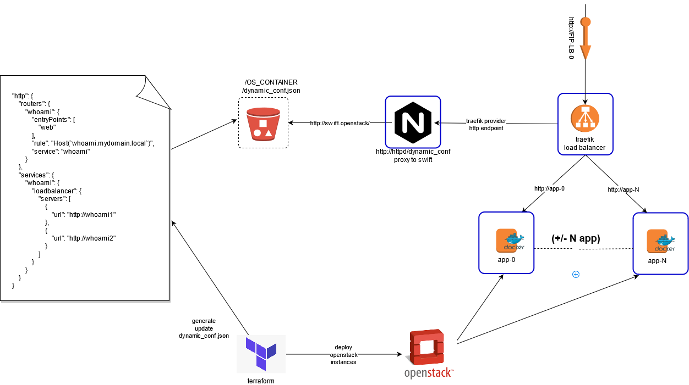

# simple-traefik-http-provider with openstack swift

Two use case of traefik-http-provider:

For some projects, i need to deploy instances behing loadbalancer with terraform in an openstack cloud without LBaas available.

So, here the workflow, i want:
 * use provisionning tool (ex terraform or other tool) to provision instances app + lb stack (traefik + small httpd proxy + openstack swift object)
 * terraform dynamically generates traefik template file `dynamic_conf.json` with IP of instances and Floating IP (or Host url) and store it in an openstack swift object
 * traefik contact every X seconds, the intermediate httpd provider endpoint, which point to the Swift URL hosting the dynamic configuration

Benefits:
* You can increase (or delete/recreate) the number of traefik instances, configuration files is always in stores in swift
* the intermediate nginx container can act as a cache, in case of swift is unavailable
* the intermediate nginx container store tempurl URL. It is not exposed to public interface
* template configuration file is under your control without modifying traefik or httpd component

In this repository, you will find only the small docker-compose stack (traefik, nginx, and sample dynamic_conf.json).

You cand deploy this stack on a Loadbalancer instance with the `ci/docker-deploy.sh` script.

The terraform part is not described here, but you can find a version in my [openstack-terraform-app repository reference](https://github.com/pli01/terraform-openstack-app/)


# Design


## scenario 1 (without swift openstack)
```
[ traefik ] -> [ httpd -> dynamic_conf file ]
[ traefik ] -(routing)-> [ whoami1 | whoami2 ]
```

* traefik container with http provider: listening on `http://127.0.0.1:80/`
* httpd container hosting dynamic_conf.json : `http://httpd/dynamic_conf.json`
* 2 whoami containers displaying usefull information (hostname IP)  on `http://whoami1 or http://whoami2`

* [docker-compose http file](docker-compose.http.yml)
* [dynamic_conf.json file](dynamic_conf.json)

## scenario 2 (with swift openstack)
```
[ traefik ] -> [ httpd -> proxy_pass ] -> [Openstack Swift Container]/[Openstack Swift Object dynamic_conf.json]
[ traefik ] -(routing)-> [ whoami1 | whoami2 ]
```

* traefik container with http provider: listening on `http://127.0.0.1:80/`
* httpd container routing to Openstack swift object storage : `http://httpd/lb-conf/dynamic_conf.json`
* openstack swift container hosting dynamic_conf.json:  OS_STORAGE_URL, OS_CONTAINER, OS_OBJECT
* 2 whoami container displaying usefull information (hostname IP)  on `http://whoami1 or http://whoami2`

* [docker-compose file](docker-compose.yml)
* [nginx-dynamic_conf.template file](nginx-dynamic_conf.template)
* [.env file](dot-env.sample)
* [dynamic_conf.json file](dynamic_conf.json)

# Configuration
Create your `.env`i from `dot-ev.sample`, to define your configuration

| Environement Variable | Description | Example |
|---|---|---|
| Traefik configuration |||
| `TRAEFIK_*`|  https://doc.traefik.io/traefik/v2.3/reference/static-configuration/env/ | `http://httpd/lb-conf/dynamic_conf.json` |
| Nginx configuration |||
| `OS_STORAGE_URL`| Swift Root URL | `https://object-store.api.pi.dsic.minint.fr/v1/AUTH_XXXXXXXXX` |
| `OS_CONTAINER`| Swift Container | `lb-conf` |
| `OS_OBJECT`| Swift Object (the real http config traefik file) | `dynamic_conf.json` |

# Deploy it
```
ci/docker-deploy.sh
```

# Test the traefik/httpd/whoami version
```
#docker-compose -f docker-compose.http.yml up -d
Creating network "simpletraefikhttpprovider_traefik-network" with driver "bridge"
Creating simpletraefikhttpprovider_traefik_1 ... done
Creating simpletraefikhttpprovider_whoami1_1 ... done
Creating simpletraefikhttpprovider_whoami2_1 ... done
Creating simpletraefikhttpprovider_httpd_1   ... done

# curl -H 'Host: whoami.mydomain.local' http://127.0.0.1
Hostname: 14af84badd78
IP: 127.0.0.1
IP: 172.29.0.4
RemoteAddr: 172.29.0.2:36838
GET / HTTP/1.1
Host: whoami.mydomain.local
User-Agent: curl/7.52.1
Accept: */*
Accept-Encoding: gzip
X-Forwarded-For: 172.29.0.1
X-Forwarded-Host: whoami.mydomain.local
X-Forwarded-Port: 80
X-Forwarded-Proto: http
X-Forwarded-Server: 44cf085fbde8
X-Real-Ip: 172.29.0.1

# curl -H 'Host: whoami.mydomain.local' http://127.0.0.1
Hostname: 299346f0d50e
IP: 127.0.0.1
IP: 172.29.0.3
RemoteAddr: 172.29.0.2:54310
GET / HTTP/1.1
Host: whoami.mydomain.local
User-Agent: curl/7.52.1
Accept: */*
Accept-Encoding: gzip
X-Forwarded-For: 172.29.0.1
X-Forwarded-Host: whoami.mydomain.local
X-Forwarded-Port: 80
X-Forwarded-Proto: http
X-Forwarded-Server: 44cf085fbde8
X-Real-Ip: 172.29.0.1

#docker-compose -f docker-compose.http.yml down 
```


# Sources/Inspirations
* https://www.grottedubarbu.fr/traefik-2-3-http-provider/
* https://github.com/NETWAYS/traefik-provider-openstack
